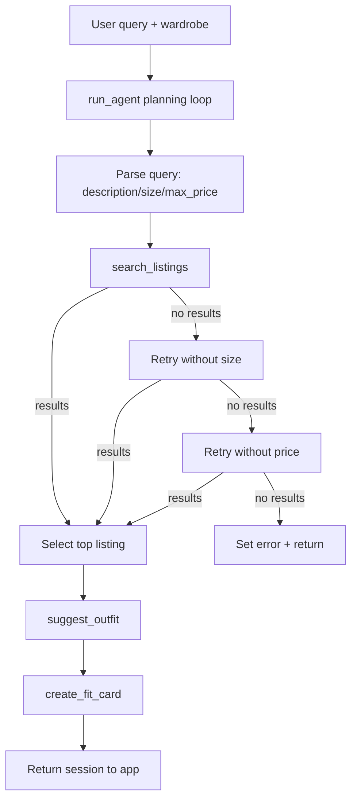

# FitFindr — planning.md

> Complete this document before writing any implementation code.
> Your spec and agent diagram are what you'll use to direct AI tools (Claude, Copilot, etc.) to generate your implementation — the more specific they are, the more useful the generated code will be.
> Your planning.md will be reviewed as part of your submission.
> Update it before starting any stretch features.

---

## Tools

List every tool your agent will use. For each tool, fill in all four fields.
You must have at least 3 tools. The three required tools are listed — add any additional tools below them.

### Tool 1: search_listings

**What it does:**
Searches the local `listings.json` dataset for secondhand items matching the user request. It filters by optional size and optional max price, then ranks results by keyword relevance.

**Input parameters:**
<!-- List each parameter, its type, and what it represents -->
- `description` (str): ...
- `size` (str | None): Optional size filter (e.g., `M`, `W30`, `8`). If `None`, no size filtering is applied.
- `max_price` (float | None): Optional maximum price filter. If `None`, no price filtering is applied.

**What it returns:**
Returns `list[dict]` of listings sorted by best match first. Each dict includes: `id`, `title`, `description`, `category`, `style_tags`, `size`, `condition`, `price`, `colors`, `brand`, `platform`.

**What happens if it fails or returns nothing:**
The tool returns an empty list instead of raising. The agent checks for empty results, tells the user no matches were found, and retries with loosened constraints (first size, then price) before asking for a broader query.

---

### Tool 2: suggest_outfit

**What it does:**
Builds outfit combinations around the selected thrift item using wardrobe context. Uses the LLM for style reasoning, and supports both populated wardrobes and empty wardrobes.

**Input parameters:**
<!-- List each parameter, its type, and what it represents -->
- `new_item` (dict): ...
- `wardrobe` (dict): Wardrobe object with an `items` list of current closet pieces.

**What it returns:**
Returns a non-empty `str` with 1–2 outfit suggestions.

**What happens if it fails or returns nothing:**
If wardrobe is empty, it returns general styling guidance instead of failing. If LLM call fails, it returns a deterministic fallback outfit suggestion so the agent can continue.

---

### Tool 3: create_fit_card

**What it does:**
Generates a short social-ready caption for the final look. Combines the selected listing and the outfit suggestion into a shareable "fit card."

**Input parameters:**
<!-- List each parameter, its type, and what it represents -->
- `outfit` (...): ...
- `new_item` (dict): Selected listing used in the outfit.

**What it returns:**
Returns a `str` caption (2–4 sentences).

**What happens if it fails or returns nothing:**
If outfit input is missing/blank, it returns an explicit error string. If the LLM call fails, it returns a fallback caption so the user still gets output.

---

### Additional Tools (if any)

<!-- Copy the block above for any tools beyond the required three -->

---

## Planning Loop

**How does your agent decide which tool to call next?**
The loop is state-driven:
1. Parse query into `description`, `size`, and `max_price`.
2. Call `search_listings`.
3. If no results, retry with relaxed constraints (drop size, then drop price).
4. If still no results, stop and return an error.
5. If results exist, pick top listing and call `suggest_outfit`.
6. Call `create_fit_card` using the outfit + selected item.
7. Return completed session when fit card is ready or when an error terminal state is reached.

---

## State Management

**How does information from one tool get passed to the next?**
A single `session` dict stores all interaction state: raw query, parsed fields, search results, selected item, wardrobe, outfit suggestion, fit card, and error. The selected listing from `search_listings` is persisted in `session["selected_item"]` and passed into `suggest_outfit`, then both selected item + outfit are passed into `create_fit_card`.

---

## Error Handling

For each tool, describe the specific failure mode you're handling and what the agent does in response.

| Tool | Failure mode | Agent response |
|------|-------------|----------------|
| search_listings | No results match the query | Retry with loosened constraints; if still empty, return a helpful message asking user to broaden query |
| suggest_outfit | Wardrobe is empty | Switch prompt strategy to general styling advice for the new item |
| create_fit_card | Outfit input is missing or incomplete | Return explicit error string and stop final caption generation |

---

## Architecture

---

## AI Tool Plan

<!-- For each part of the implementation below, describe:
     - Which AI tool you plan to use (Claude, Copilot, ChatGPT, etc.)
     - What you'll give it as input (which sections of this planning.md, your agent diagram)
     - What you expect it to produce
     - How you'll verify the output matches your spec before moving on

     "I'll use AI to help me code" is not a plan.
     "I'll give Claude my Tool 1 spec (inputs, return value, failure mode) and ask it to implement
     search_listings() using load_listings() from the data loader — then test it against 3 queries
     before trusting it" is a plan. -->

**Milestone 3 — Individual tool implementations:**
Use Copilot/LLM with the completed tool specs (inputs/outputs/failure mode) to implement each tool one at a time. After each implementation, run direct function-level sanity checks from CLI and verify fallback behavior.

**Milestone 4 — Planning loop and state management:**
Use the loop/state sections plus architecture diagram to implement `run_agent`. Verify that each state field updates in order and that error exits happen before downstream tool calls when needed.

---

## A Complete Interaction (Step by Step)

Write out what a full user interaction looks like from start to finish — tool call by tool call. Use a specific example query.

**Example user query:** "I'm looking for a vintage graphic tee under $30. I mostly wear baggy jeans and chunky sneakers. What's out there and how would I style it?"

**Step 1:**
Parse user query into structured parameters: description="vintage graphic tee", size="M", max_price=30.0. Then call `search_listings(description, size, max_price)`.

**Step 2:**
Take top listing from returned list (e.g., "Faded Band Tee — $22"). Save it in session state as `selected_item`, then call `suggest_outfit(selected_item, wardrobe)`.

**Step 3:**
Store outfit text in `outfit_suggestion`, then call `create_fit_card(outfit_suggestion, selected_item)` and store output in `fit_card`.

**Final output to user:**
User sees: (1) formatted top listing details, (2) outfit recommendation using wardrobe pieces, (3) final shareable fit card caption.
